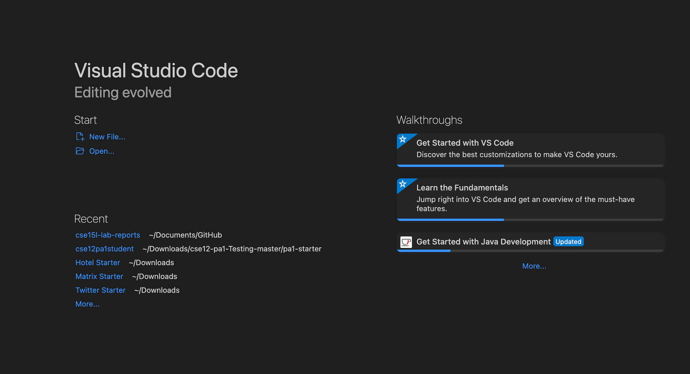
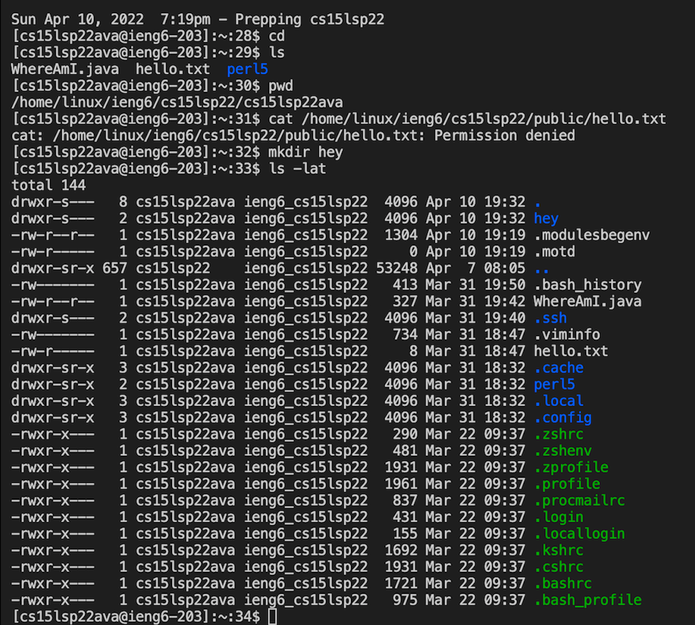
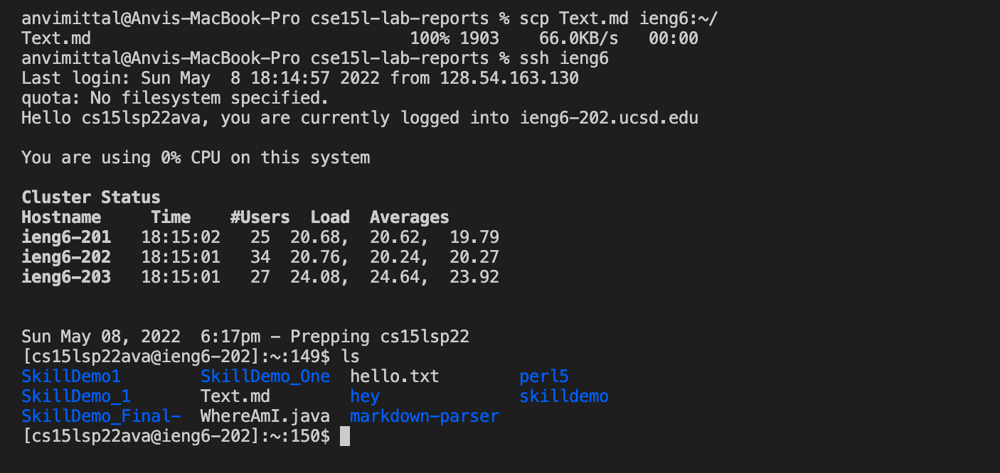
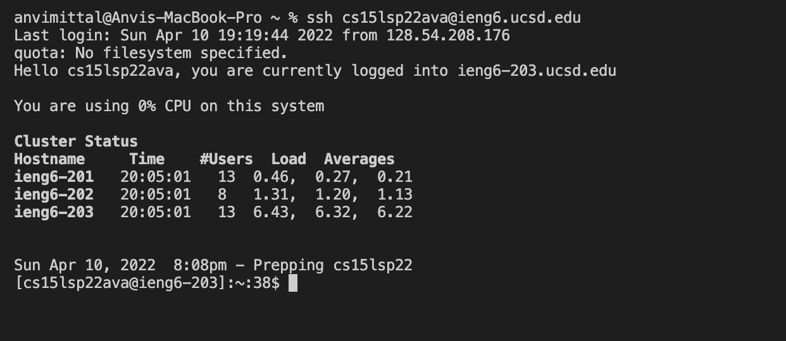

# **Lab Report 1**
## *Anvi Mittal*

[Home](index.html)
 
 
**This lab report is a tutorial on how to remotely connect to a server i.e how to log into a course-specific account on ieng6.**

Please follow the steps below:

1. **Installing VS Code**  
Go to the [Visual Studio Code website](https://code.visualstudio.com/) and follow the
instructions to download and install it on your computer. Once it is installed it must look something like this:

2. **Remotely Connecting**  
Open a terminal in VS Code and use the `ssh` command followed by your account name to connect to the server. The command should look something like :  
`ssh cs15lsp22ava@ieng6.usd.edu`  
 * Note : Replace ava with the letters in your course specific account  

     If you're connecting to the server for the first time, you will get a message asking if you want to continue connecting; reply with a yes. Then enter your password. Now, your account is connected to the server and the final setup should look something like this: 

3. **Trying Some Commands**
Try running some commands to see what may happen, like-
* `cd` : change directory
* `ls`: list files
* `cat /home/linux/ieng6/cs15lsp22/public/hello.txt` : creates a new text file
* `mkdir` : makes a directory
* `pwd` : prints working directory
* `ls -lat` : Lists all hidden files in order of the time when they were last modified (newest first)

For example-

4. **Moving Files with `scp`**  
In order to copy a file from your computer to a remote computer, we use the command `scp`. This command will always be run from your computer(client). Log out of `ieng6` by running the command `exit` or using `Ctrl+D`. Create a new java file on VS Code and save it. Use the following command to copy the file: scp /name of the file/ cs15lsp22ava@ieng6.usd.edu:~/ . You will be prompted for a password as usual. Now log into ieng6 and use the `ls` command. You should see the new java file copied here: 
(*In this case, WhereAmI.java is the file to be copied*)

5. **Setting an SSH Key**
Every time we log into `ieng6` or use `scp`, we are required to enter our password which is time-consuming. In order to avoid this we can use the `ssh keygen` program which creates a pair of files called the public key and private key. You copy the public key to a particular location on the server, and the private key in
a particular location on the client. Then, the ssh command can be used instead of your password. On your computer, run the `ssh-keygen` command which will prompt you to enter a passphrase. **Do not** enter one. Your ssh keygen is now set up. See the image below to see more: 

6. **Optimizing Remote Running**
To optimize your commands, you can:
 * Write a command in quotes at the end of an ssh command to directly
run it on the remote server.
* You can use semicolons to run multiple commands on the same line

