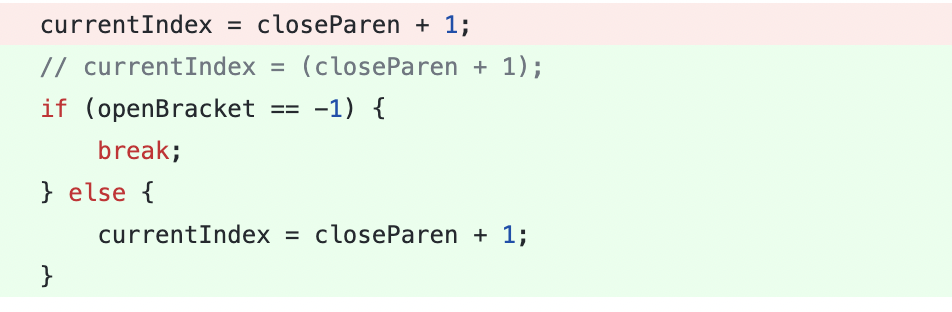
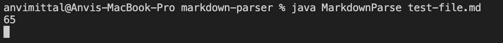
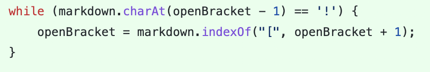
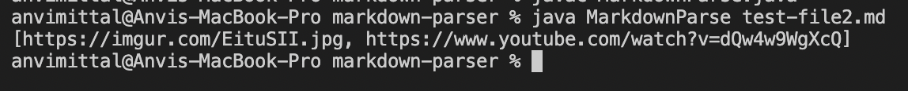
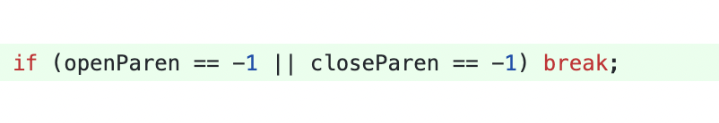
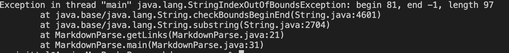

# Lab Report 2
# *Anvi Mittal*

[Home](index.html)
 
 

***

**Code Change 1**

Fixes the issue of an infinite loop in test-file.md

Github Code Change

[Failure Inducing Input](https://github.com/AnviMittal/markdown-parser/blob/main/test-file.md)

Symptom

The bug in the code caused files with blank lines at the end of the file (failure inducing inputs) to fail when run with MarkdownParse. This resulted in a symptom of an infinite loop as shown in the above picture where currentIndex is printed without the program terminating. The bug was caused by the absence of a break statement in the while loop when a closed bracket couldn't be found. 

**Code Change 2**

Fixes the issue of images being treated as links

Github Code Change

[Failure Inducing Input](https://github.com/AnviMittal/markdown-parser/blob/main/test-file2.md)

Symptom

The bug in this code caused images to be treated as links. The symptom of the bug was that links to images were being included in the output array. The bug was caused because there wasn't a check in the original code for a "!" before an open bracket. Failure inducing inputs are files with links in them.

**Code Change 3**

Fixes the issue of no closing parenthesis at the end of a link

Gihub Code Change

[Failure Inducing Input](https://github.com/AnviMittal/markdown-parser/blob/main/test-file3.md)

Symptom

The bug in this code caused links without a closing pair of parenthesis (failure inducing inputs) to fail when run with MarkdownParse. The symptom of this bug was that the program threw an index out of bounds error when such links were passed in. The bug was caused by the absence of a break statement in the while loop in case a closing parenthesis could not be found. 

