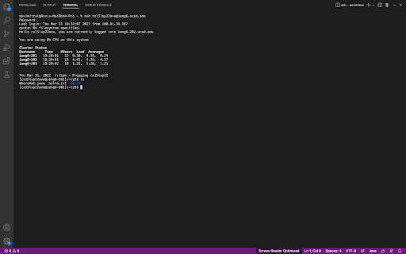
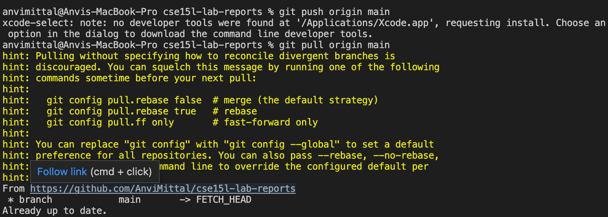

# Lab Report 3
# *Anvi Mittal*

[Home](index.html)
<br />
<br />

***

**Streamlining `ssh` Configuration**

When we log into `ieng6`, we must type the command `ssh cs15lsp22ava@ieng6.ucsd.edu` every single time. In order to streamline this process, we can put an entry in `~/.ssh/config` that tells SSH what username to use when logging into a specific server. So, open `~/.ssh/config` and all the following lines in it:

```
Host ieng6
HostName ieng6.ucsd.edu
User cs15lsp22ava (use your own username)
```


By doing this, you can login into `ssh` by simply using the command `ssh ieng6`. For example-


To copy a file from your laptop to a remote server, we can use the command `scp` and instead of typing out the entire username, all we need to do is use `ieng6` and the file will be copied. 
For example (I have used `scp` to copy the file `Text.md`) -


**Setting up Github Access from `ieng6`**

In order to set up github access from the command line, we need to set up a token-based login mechanism like `SSH Keys`. Follow this [tutorial](https://docs.github.com/en/authentication/connecting-to-github-with-ssh/adding-a-new-ssh-key-to-your-github-account)
to be able to use commands like `git push` directly from the command line. 

It should look something like-
