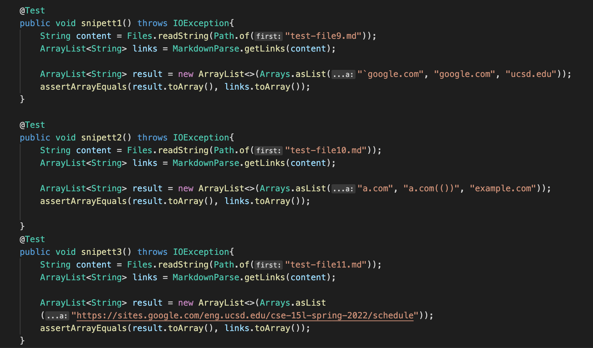

# Lab Report 4
# *Anvi Mittal*

[Home](index.html)
 
 

***

[My markdown-parser repository](https://github.com/AnviMittal/markdown-parser)  

[The markdown-parser reviewed](https://github.com/Steven-Hsu1/markdown-parser)

Junit tests created for the snippets provided:

Tests failed on my markdown-paser:

Tests failed on the reviewed markdown-paser:

What the expected output should have looked like:

How can we get this code to work:

For Snippet 1:  
We can get the code to work with a small (<10 lines) change. We would need to find and remove all the backticks that are in parentheses of URLs since that would give us an error and then try running the code.

For Snippet 2:  
We can get the code to work with a small (<10 lines) change. We would need to use nested if conditions to find the last possible index of the first URL by testing for the presence of the first closed bracket. Then we would need to find the index of the second URL by testing for the presence of the next open bracket and so on and so forth. Then try running the code. 

Snippet 3:  
We can get the code to work with a small (<10 lines) change. We need to find line breaks  to find the next URL. To do this, use an if conndition to find the first line break using the first closed bracket and the second open bracket and use this method to find all the URLs and then run the code. 

