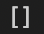
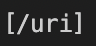
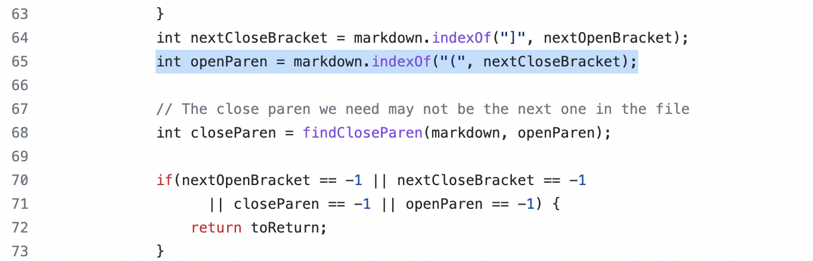
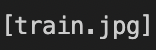
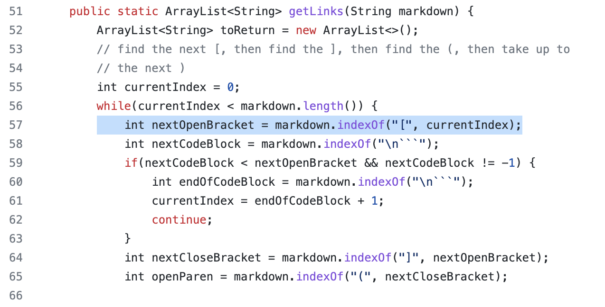

# Lab Report 5
# *Anvi Mittal*

[Home](index.html)
 
 

***

To find the tests where the two implementations of MarkdownParse.java produced different results, I simply compared the two results.txt files that had the output of running all the tests side by side. I found discrepancies in two tests, 510 and 577.

*Test 510*

[Link to test](https://github.com/nidhidhamnani/markdown-parser/blob/main/test-files/510.md)

Expected Output: []

My group's output: 

Provided code's output: 

Bug in provided implementation (line 65)

For this test, my implementation is correct. In test 510, there is a space between the closed bracket `]` and open parenthesis `(` which makes the link invalid. The given implementation doesn’t check if a `]` is immediately followed by a `(`, i.e. the difference between their character indices is 1. Adding an if statement checking this condition would fix the bug.

*Test 577*

[Link to test](https://github.com/kcyy127/cse15l-lab-reports/blob/main/report-5/577.md?plain=1)

Expected Output: []

My group's output: 

Provided code's output:

Bug in provided implementation (line 57)

My implementation is correct in this case as well. Test 577 contains an image as opposed to a link and the given implementation fails to check for images. The program should check for a `!` at the index before `nextOpenBracket`, and should be moved to the next one if one is found must be updated. 